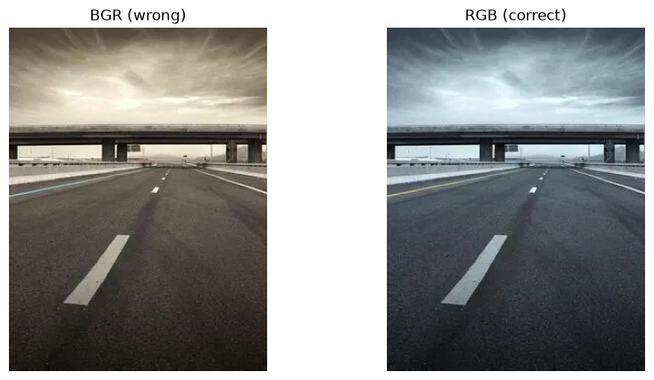

# Autonomous Driving Perception Portfolio

An applied research and engineering project investigating uncertainty-aware,
real-time bird's-eye-view (BEV) perception for safety-critical ADAS
(Advanced Driver-Assistance Systems) applications.

## Research question

Can lightweight Bayesian uncertainty estimation be integrated into a
real-time monocular BEV perception pipeline without prohibitive latency
cost — and how does that tradeoff behave under deployment-grade
optimization (FP16 quantization, embedded inference)?

This project builds toward that question incrementally: starting from
camera geometry fundamentals, through a multi-task perception pipeline,
to a deployable, benchmarked inference system.

## Project goals

- Build a complete, from-scratch perception stack — camera calibration,
  lane/road segmentation, multi-task detection — without relying on
  high-level wrapper libraries, to demonstrate depth rather than tutorial
  familiarity.
- Quantify the latency-accuracy-confidence tradeoffs of the above stack
  under real deployment constraints (ONNX export, TensorRT FP16
  quantization, C++ inference).
- Produce a reproducible, containerized codebase and an honest
  experimental writeup (target: a short technical report / workshop-style
  submission) rather than a collection of disconnected demo scripts.

## Current status

This repository is being built incrementally as part of a structured
4-month learning roadmap. Completed and in-progress components are
tracked below; this section is updated weekly.

| Module | Status | Description |
|---|---|---|
| Project scaffold | ✅ Done | Repo structure, virtual environment, requirements.txt |
| Config system | ✅ Done | YAML-backed TrainingConfig dataclass with typed fields |
| Logging | ✅ Done | get_logger() factory with timestamps and severity levels |
| OpenCV fundamentals | ✅ Done | BGR vs RGB, resize, grayscale, bounding box annotation |
| Camera geometry | 🔲 Not started | World→camera→image projection, homography/IPM |
| Multi-task ADAS pipeline | 🔲 Not started | Shared backbone, segmentation + detection heads |
| Temporal consistency | 🔲 Not started | Feature fusion across frames |
| Uncertainty quantification | 🔲 Not started | MC Dropout, epistemic uncertainty visualization |
| Deployment (ONNX/TensorRT) | 🔲 Not started | FP32→FP16 quantization, latency profiling |
| C++ inference | 🔲 Not started | Modern C++ inference loop |
| ROS2 integration | 🔲 Not started | Minimal perception node |

## Sample Output



## Repository structure

av-perception-portfolio/

├── 01_camera_geometry/      # World→camera→image pipeline, IPM/BEV

├── 02_multitask_adas/       # Shared backbone, seg + detection heads

│   ├── src/

│   │   ├── config.py        # TrainingConfig dataclass + yaml loader

│   │   └── utils/

│   │       └── logger.py    # get_logger() factory

│   └── configs/

│       ├── default.yaml     # full training config

│       └── debug.yaml       # small values for fast test runs

├── requirements.txt

└── README.md


Each module folder contains its own README with setup and run
instructions as it is developed.

## Setup

```bash
git clone https://github.com/arpitt14/av-perception-portfolio.git
cd av-perception-portfolio
python -m venv .venv
source .venv/bin/activate
pip install -r requirements.txt
```

## Running the config system

```bash
cd 02_multitask_adas
python -m src.config
```

Expected output:

23:43:50 | INFO | main | Config loaded: TrainingConfig(learning_rate=0.0001, batch_size=8, num_epochs=50, image_height=512, image_width=512)


## Background

Built by a Mathematics and Computing undergraduate as part of a structured
preparation track toward autonomous vehicle perception engineering,
combining a theoretical foundation in linear algebra, probability, and
deep learning with hands-on production-style implementation.